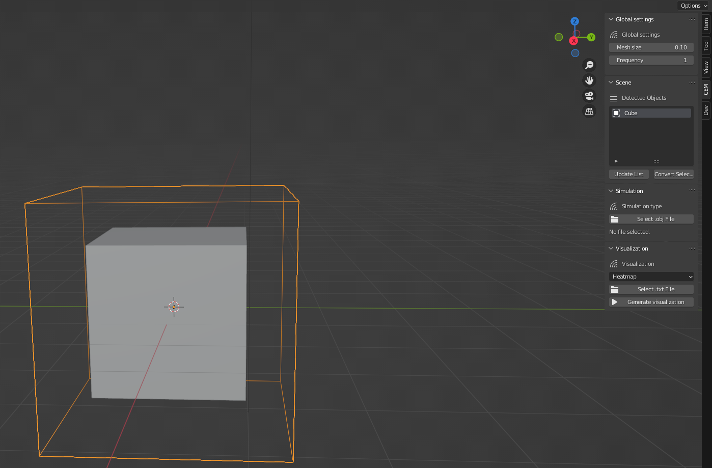
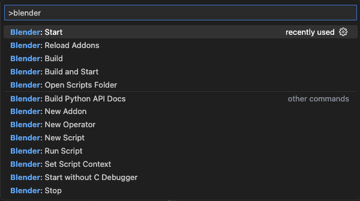
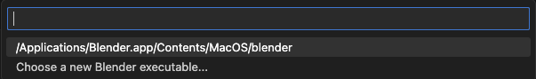
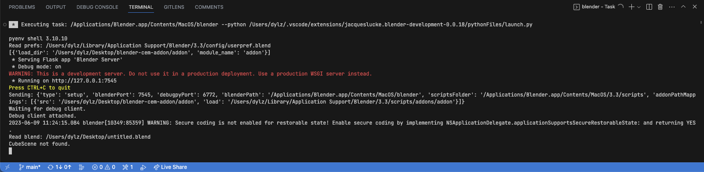
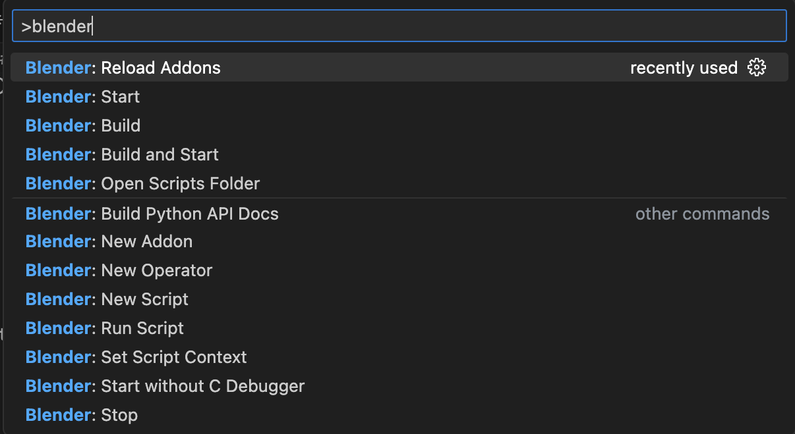
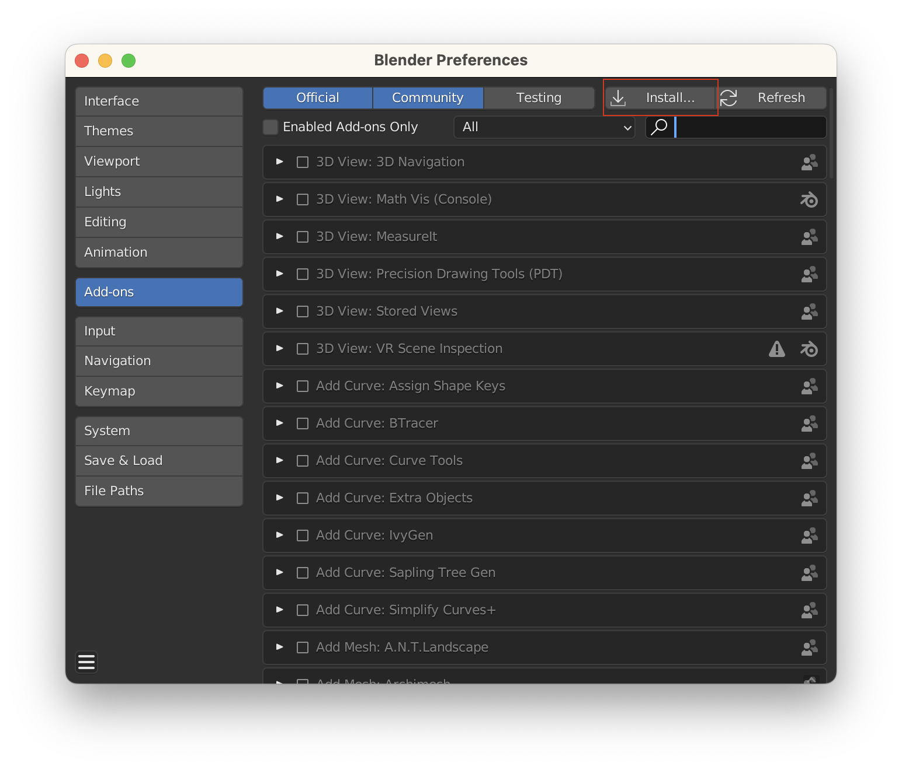
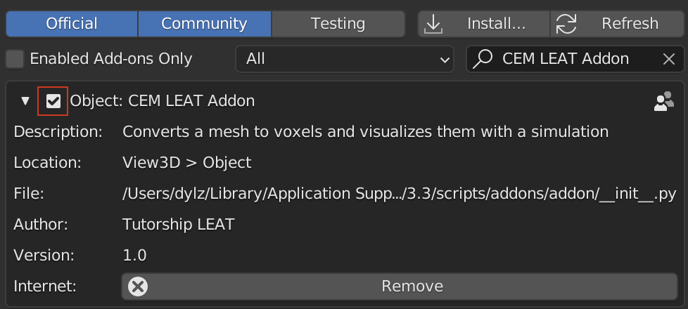

# blender-cem-addon

Addon to convert object in the scene in voxels. Simulate and visualize stuff around.



## Requirements

Install Blender from the [Official Website](https://www.blender.org/download/) the version 3.3 or above.

> - For Linux, please do not use any packet manager, install it from the source `tar.gz`
> - For MacOS and Windows use the official installer

## First install

This section is a *step-by-step* guide for installing the addon in order to contribute to the project.

### Configure Workspace

In order to develop the add-on, you should use VSCode. You can install the extension [Blender Development](https://marketplace.visualstudio.com/items?itemName=JacquesLucke.blender-development) to have a better experience.

Once you have installed the extension, you can open Blender by using `CTRL+SHIFT+P`.

1. Select `Blender: Start`



2. For the first run select `Choose a new Blender executable...`



Now Blender is open in development mode.

3. You can now see the console and the python editor to debug the add-on easily.



4. In development mode you can easily reload the add-on when you modified the files by using `CTRL+SHIFT+P` and select `Blender: Reload Scripts`



### Install in production mode

1. First you need to generate the zip file of the add-on project. In the terminal, run the following command at the root path of the project :

```sh
make
```

You should have this output:

```sh
➜  blender-cem-addon git:(main) ✗ make
rm -rf blender-cem-addon.zip
rm -rf ./addon/__pycache__
zip -r blender-cem-addon.zip ./addon
  adding: addon/ (stored 0%)
  adding: addon/plot.py (deflated 70%)
  adding: addon/visualisations.py (deflated 25%)
  adding: addon/constants.py (deflated 26%)
  adding: addon/simulations.py (deflated 63%)
  adding: addon/__init__.py (deflated 53%)
  adding: addon/scene_opt.py (deflated 69%)
  adding: addon/voxelizer.py (deflated 72%)
  adding: addon/converters.py (deflated 69%)
  adding: addon/init.py (deflated 71%)
  adding: addon/visualization_opt.py (deflated 70%)
  adding: addon/settings_opt.py (deflated 64%)
  adding: addon/simulation_opt.py (deflated 70%)
```

The file `blender-cem-addon.zip` has been generated.

2. Now you can install the add-on in Blender. Open Blender and go to `Edit > Preferences > Add-ons > Install...` and select the zip file generated in the previous step.



Don't forget to check the box to activate the add-on.



## Project dependencies

Dependencies are register in the [constants.py](./addon/constants.py) file. You can add dependencies by adding new item to this list :

```py
DEPENDENCIES = ['seaborn', 'trimesh', 'matplotlib', 'pandas', 'numpy', 'scipy']
```

## Documentation

## Use the add-on